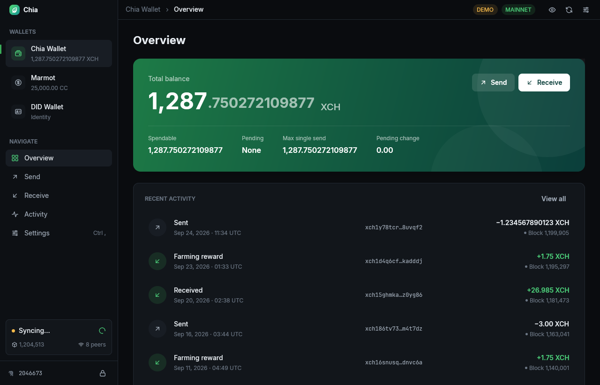
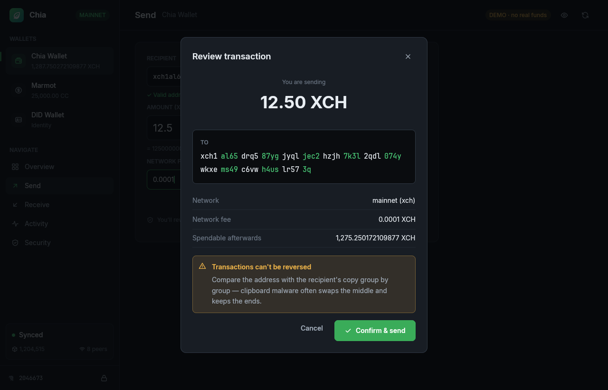
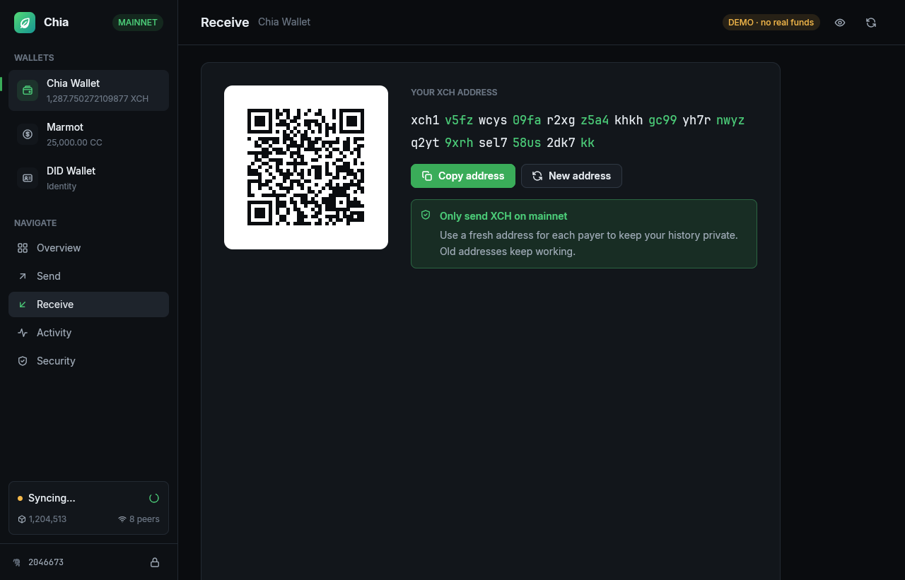
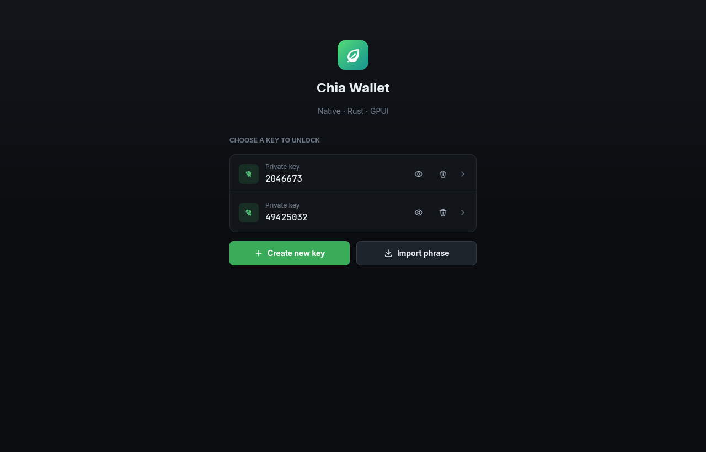
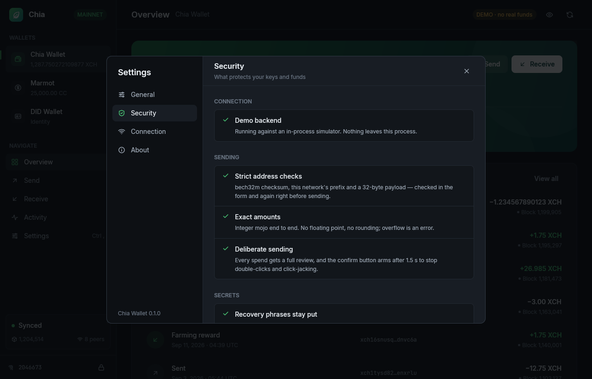

# Chia Wallet — native (Rust + GPUI)

A native desktop wallet for Chia, built on [GPUI](https://www.gpui.rs/) (the UI framework behind the Zed editor). It replaces the Electron/React wallet screens in `chia-blockchain-gui` and talks to the same Python daemon (`chia/daemon/server.py`) over the same websocket protocol. Nothing on the backend has to change.



| Review before sending | Receive |
|---|---|
|  |  |
| **Keys** | **Settings** |
|  |  |

## Running it

```sh
cd wallet-rs
cargo run --release -p chia-wallet -- --demo          # simulated wallet: no daemon, no funds, no network
cargo run --release -p chia-wallet                    # your local daemon (~/.chia/mainnet or $CHIA_ROOT)
cargo run --release -p chia-wallet -- --root <dir>    # another Chia root
```

| Flag | Effect |
|---|---|
| `--demo` | Runs an in-process simulator. Blocks arrive every 6 s, sends confirm after two blocks, and a farming reward lands now and then. |
| `--allow-remote-daemon` | Allows a non-loopback `ui.daemon_host`. By default one is refused. |
| `--no-auto-hide` | Stops balances from hiding when the window loses focus or sits idle. |

The app reads `config/config.yaml` from the Chia root and uses these values from it:
- `ui.daemon_host` and `ui.daemon_port`
- `ui.daemon_ssl.private_crt/key`
- `private_ssl_ca.crt`
- `selected_network`, which also gives the address prefix

When it starts, it asks the daemon to start `chia_wallet`, the same way the Electron app does.

**macOS:** the Xcode Command Line Tools are enough (`xcode-select --install`). GPUI's Metal shaders are compiled when the app starts (the `runtime_shaders` feature), so the `metal` compiler from full Xcode isn't needed.

**Linux build dependencies** (the same ones GPUI needs): `libxkbcommon-dev libxkbcommon-x11-dev libwayland-dev libvulkan-dev libx11-xcb-dev libfontconfig-dev libfreetype-dev libzstd-dev`, a Vulkan driver, and `clang`.

### End-to-end against a mock daemon

`mock_daemon` generates a Chia-style root and serves the daemon protocol over **real mutual TLS**:
- a private CA
- `private_daemon.crt/.key` with the `chia.net` SAN
- `config.yaml`

The wallet commands behind it are backed by the simulator. With it you can exercise the non-demo client path, including reconnects, without a Python install:

```sh
cargo run -p chia-wallet-core --example mock_daemon -- /tmp/chia-root 55400 &
CHIA_ROOT=/tmp/chia-root cargo run -p chia-wallet
```

## Layout

```
wallet-rs/
├── crates/core   chia-wallet-core: no UI code. Everything that touches money, keys or the network.
│   ├── client.rs    mTLS websocket client (own Tokio thread, runtime-agnostic API)
│   ├── api.rs       typed wallet RPCs (log_in, get_wallets, send_transaction, cc_spend, …)
│   ├── protocol.rs  wire types mirroring ws_message.py / wallet_rpc_api.py
│   ├── address.rs   strict bech32m (checksum, prefix, 32-byte payload)
│   ├── units.rs     integer-only mojo parsing/formatting
│   ├── bip39.rs     local word-list + checksum validation
│   ├── secret.rs    zeroize-on-drop containers with redacted Debug
│   ├── config.rs    Chia root / config.yaml discovery, loopback policy
│   └── demo.rs      in-process simulator speaking the same RPC shapes
└── crates/app    chia-wallet: the GPUI application
    ├── store.rs     single state entity + async controller (all RPCs go through here)
    ├── root.rs      phase routing, toasts, blur/idle privacy
    ├── keys.rs      key picker, create (with backup verification), import, delete, reveal
    ├── shell.rs     sidebar, overview, receive (QR), activity (virtualised list), dialogs
    ├── shell/settings.rs  settings modal: general, security, connection, about
    ├── send.rs      validated send form → confirmation dialog
    ├── text_input.rs  zeroizing, maskable text field (adapted from GPUI's input example)
    └── qr.rs        QR painted as quads
```

Design choices:
- Views never call the backend directly. They call methods on `Store`, which spawns tasks on GPUI's executor and writes the results back.
- Pushes from the wallet (`state_changed`: `coin_added`, `tx_update`, `new_peak`, …) drive refreshes. Bursts of pushes are merged, and there is a 20 s poll as a fallback.
- The activity list uses GPUI's `uniform_list`, so only the rows on screen are laid out.

## Analysis of the Electron frontend, and what changed

The old GUI connects to `wss://localhost:55400` and registers as `wallet_ui`. It sends commands to `chia_wallet`, and the replies are matched by `request_id`. This port keeps that protocol exactly as it is, and changes how the client behaves around it:

| Area | Electron GUI (`chia-blockchain-gui`) | This wallet |
|---|---|---|
| Daemon TLS | `rejectUnauthorized: false`: any certificate is accepted, so a MITM is possible if `daemon_host` is remote | The server certificate must chain to `private_ca.crt` (SAN `chia.net`), and the connection uses mutual TLS |
| Remote daemon | Silently allowed | Refused unless `--allow-remote-daemon` is passed |
| Renderer | `nodeIntegration: true`, `enableRemoteModule`, no context isolation, `remote`/`shell` exposed on `window`, CSP allows `unsafe-inline`, CC name goes into `dangerouslySetInnerHTML`. Any XSS becomes remote code execution | No web engine at all. Icons and fonts are compiled into the binary, and `unsafe_code` is forbidden in both crates |
| Amounts | Converted through JavaScript floats: precision is lost above about 9,007 XCH, and values can be sent as `1e+21` | `u64` mojo end to end, checked arithmetic, overflow checks on in release builds, no floats in the core crate (lint enforced) |
| Addresses | Only checks for the substring "colour"; the backend ignores the prefix | bech32m-only checksum, network prefix and 32-byte length, checked in the form and again in the API layer |
| Sending | No confirmation step | Full review: grouped two-tone address, network, fee and remaining balance, plus a confirm button that only activates after 1.5 s |
| Mnemonics | Kept in Redux until log-out; inputs carry `autoComplete="email"`; no backup check | Held in zeroizing memory and never passed through `serde_json::Value`. Masked by default, copy is disabled, never logged. New keys require re-entering 3 random words |
| Seed reveal | One click shows `sk` + seed | Warning dialog first; the phrase hides itself after 30 s. Only `seed` is read from the reply; `sk` is never deserialized or displayed |
| Backups | `log_in` may send key-derived requests to `backup.chia.net` | `log_in`/`add_key` use `skip`, so the wallet never contacts a remote backup server |
| Clipboard | Never cleared | Cleared 45 s after copying if it still holds what was copied |
| Hangs | No timeouts; the daemon silently drops messages sent to services that aren't running | Every request has a deadline; reconnects back off exponentially and the session is resumed |
| Privacy | none | One-click privacy mode; balances hide automatically on blur or after 2 min idle |
| Key deletion | Confirm dialog | You have to type the fingerprint |

**What remains true whatever the frontend does:**
- The daemon has no password. "Lock" returns to the key picker, but the daemon keeps the key loaded until it stops.
- Keys live in the daemon's keychain. On Linux this Chia version encrypts that keychain with a hard-coded password (`chia/util/keychain.py`).
- GPUI's text shaper and our own display strings hold copies of words while they are shown. Wiping memory reduces how long secrets stay in RAM; it cannot remove them entirely.

## Feature parity

| Feature | Status |
|---|---|
| Key list, create (with verification), import (BIP-39 checked), delete, reveal phrase | ✅ |
| Standard wallet: balances, send with fee, receive + QR + new address, history | ✅ |
| Coloured coins: balance, send (`cc_spend`), receive, name | ✅ |
| Sync status, height, peers, live push updates, reconnect/resume | ✅ |
| DID and rate-limited wallets | Listed with balance/identity; management is still CLI-only |
| Trading / offers, backup file restore, plotting, farming, full-node pages | Not ported yet |

## Tests

```sh
cargo test --workspace
```

The test suite covers:
- amounts: exact parsing and formatting, and rejecting ambiguous input
- bech32m, using vectors produced by Chia's own `bech32m.py`
- BIP-39: the official vectors plus a checksum failure case
- the config loader, including YAML anchors and the loopback policy
- protocol decoding
- a full demo send/login/mnemonic flow
- `tests/daemon_mtls.rs`, which runs the real client against a mutual-TLS websocket server. It checks:
  - replies routed by request id
  - `success: false` errors
  - push events
  - request timeouts
  - refusing a daemon whose certificate comes from a different CA
